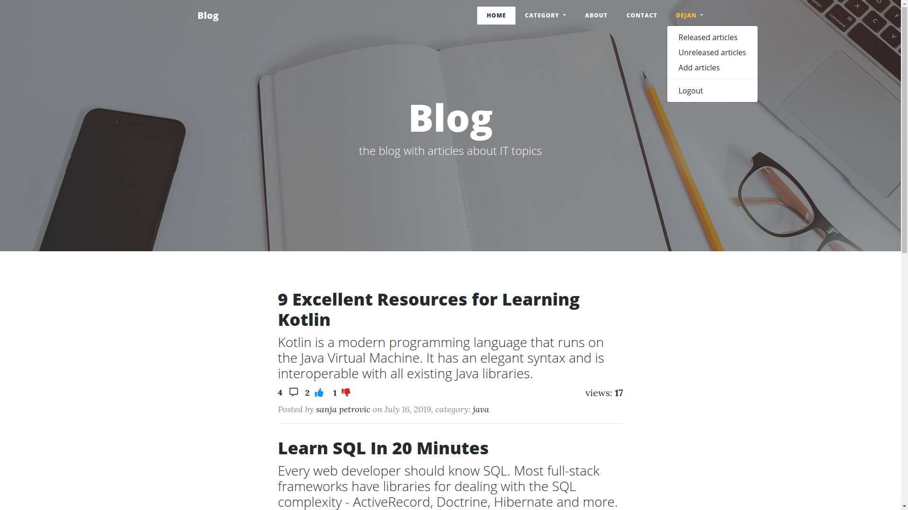
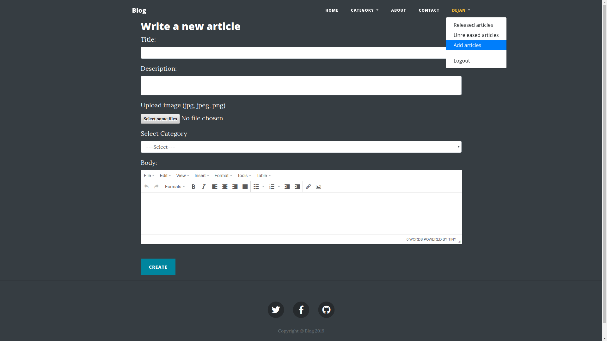
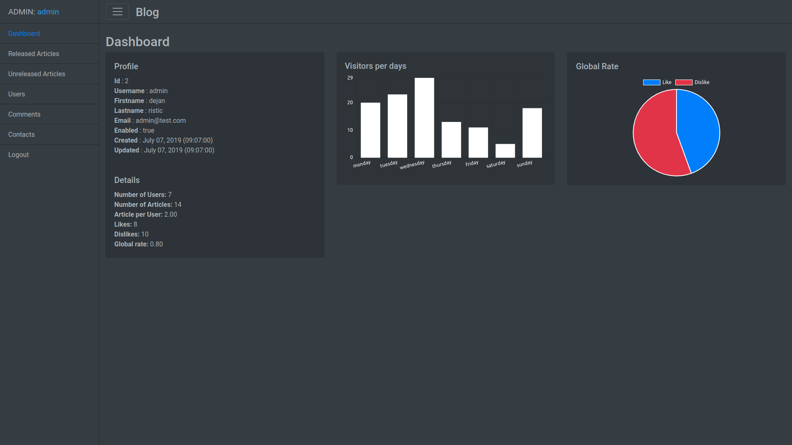

# Blog
This is a classic example of a blog. In developing were using Spring Boot, Spring Security, Spring Data JPA and so on.

## Installation

-   `git clone https://github.com/risticdejan/blog.git`
-   open at Netbeans
-   create database blog or change database name into the application.properties file, also it can import blog.sql
-   clean and build blog
-   select web module and chose to run option

## Preview

